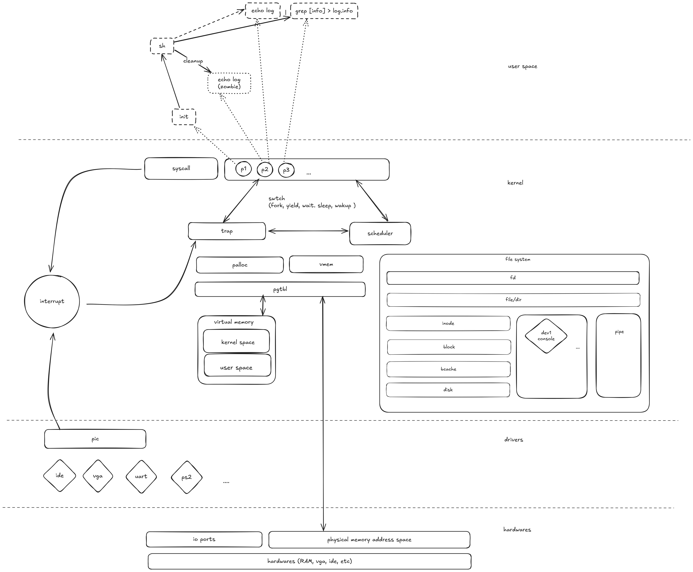

# Melon OS

Unix like operating system on i386.


## How to build

Simply run:
```
make
```
You will then see `melonos.qcow2`, `melonfs.qcow2` being built.


##### To start in qemu

```
make qemu
```

##### To enable gdb debug mode

```
GDB=1 make qemu
```


##### To interact with the OS through serial IO

Run the following on one terminal
```
make serial
```
This will wait for qemu to start.

On another one run qemu.

```
# you can turn off qemu graphics like this
GRAPHICS=0 GDB=1 make qemu
```

Now you can handle IO through the serial.

##### To print realtime debug log

Make sure build with debug flag on
```
DEBUG=1 make
```

Then, on one terminal run
```
make debug
```
It will listen to qemu's debuggin output through COM2.

Then run
```
make qemu
```
as usual.

Now all the real time debugging info will be printed on the debug terminal.


## Design

This is a rough diagram for what's going on here.


